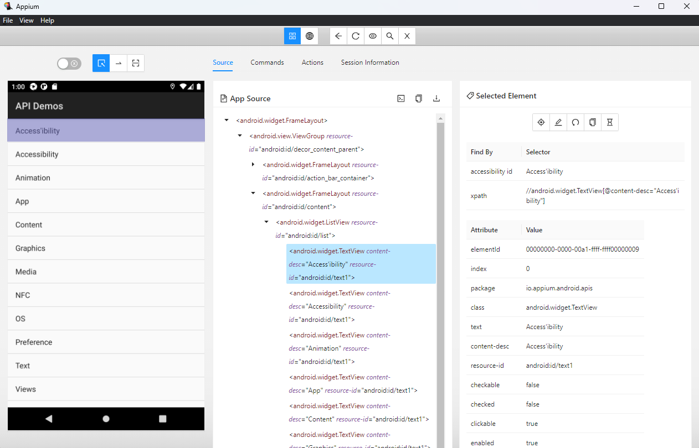

### Mobile Automated Tests

<b>Libs:</b>  
https://appium.io/  
https://github.com/appium/appium-inspector  
https://testng.org/doc/index.html  
https://developer.android.com/studio  
https://nodejs.org/en/download/  
https://www.oracle.com/br/java/technologies/downloads/

### Setup

##### You need setup these environment variables
<ul>
    <li>JAVA_HOME - directory where the JDK is installed</li>
    <li>ANDROID_HOME - directory where the Android SDK is installed</li>
    <li>PATH - %ANDROID_HOME%/platform-tools</li>
    <li>PATH - %ANDROID_HOME%/tools/bin</li>
</ul>

##### Create a virtual Device with name `AUTOMAIN_DEVICE` like this:


Install Appium
```shell
npm install -g appium@next
```

Install Appium Doctor
```shell
npm install -g appium-doctor
```

Check configuration
```shell
appium-doctor
```

List drivers
```shell
appium driver list
```

To use android this driver is necessary
```shell
appium driver install uiautomator2
```

##### Using Appium Inspector
Installation link https://github.com/appium/appium-inspector/releases  
It's an application similar than web browser inspector, used to find elements inside the app without need the app code  
  
Capabilities JSON Representation
> :warning: **Probably you will need to pass absolute path because inspector is running in another path!
```json
{
    "app": "app/ApiDemos-debug.apk",
    "deviceName": "AUTOMAIN_DEVICE",
    "automationName": "UiAutomator2",
    "platformName": "android"
}
```

##### :warning: To Start Appium Server: Important stay at root project directory
```shell
appium
```

#####  Sequence loading properties application
1. [application.properties](./src/main/resources/application.properties)
2. [application-profile.properties](./src/main/resources/application-local.properties)
3. The same properties can be load as environment variables

> :warning: To use this option you must set env variable `appium-profile` and use `,` as delimiter like this example `appium-profile=local,embedded`